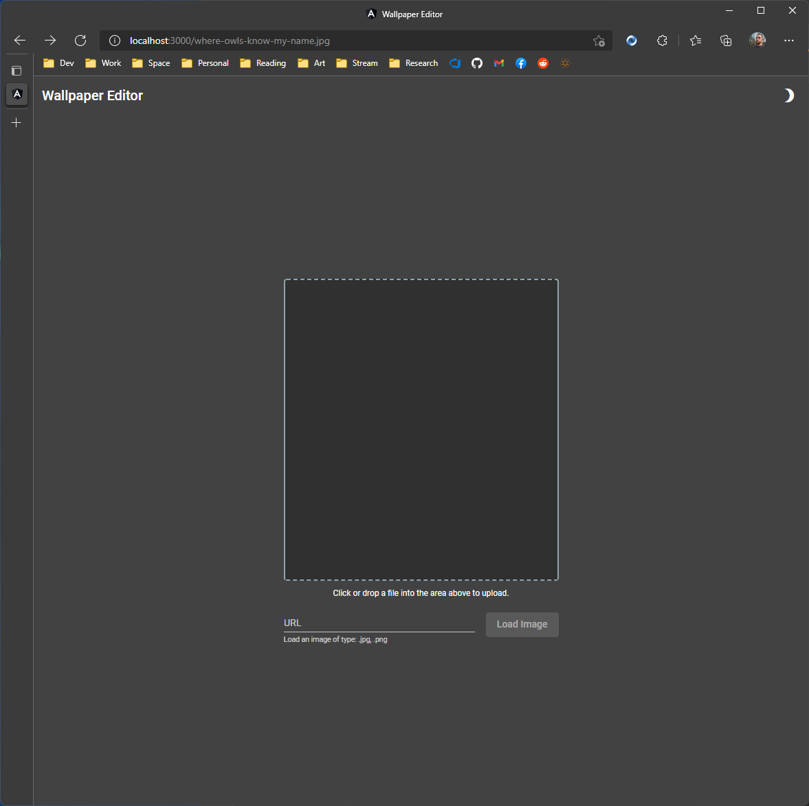
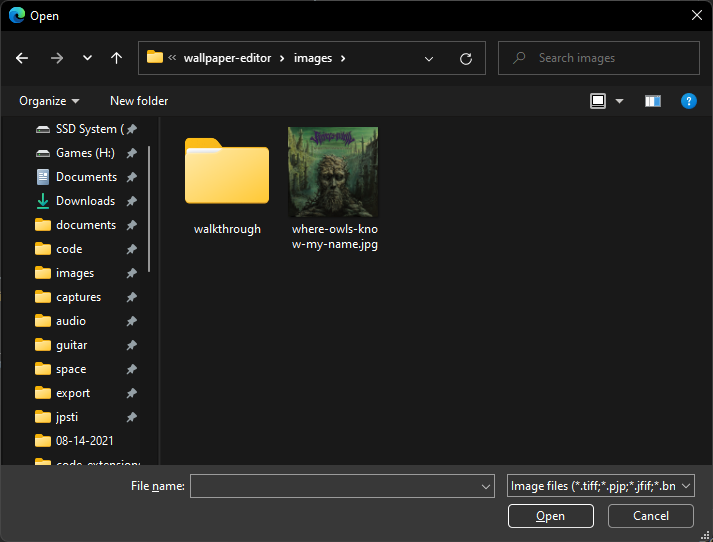
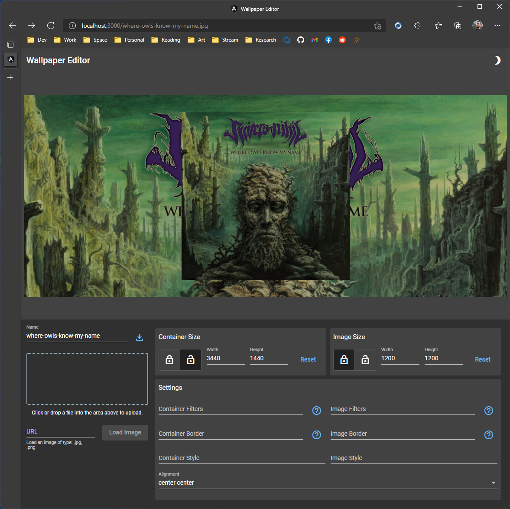
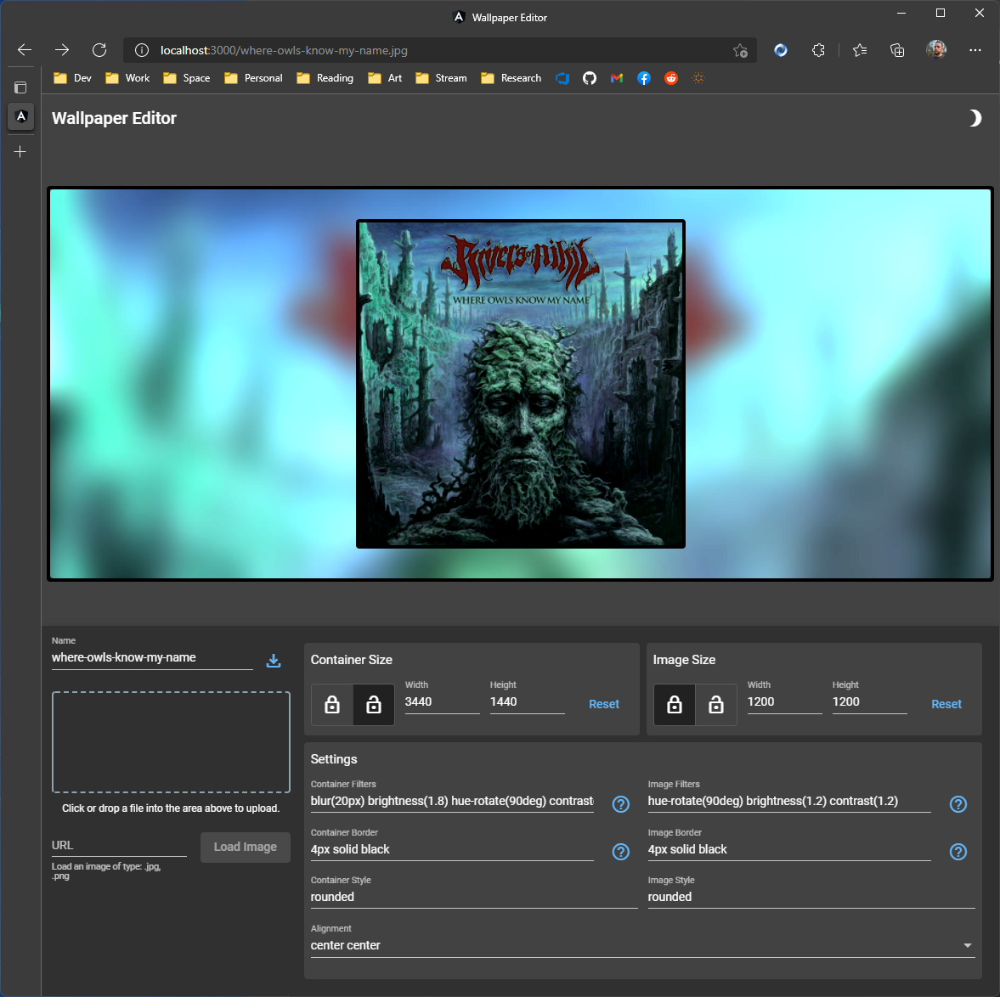

# Wallpaper Editor

  

[Live App](https://jaimestill.github.io/wallpaper-editor/)

## Walkthrough 

> Note that this project is currently being developed and not yet complete. The functionality you are seeing is a demonstration of what has been completed thus far. More functionality is being added over time.

1. From the main interface, drag a file into the box, click the box to select a file, or provide a URL to load an image:

    

    The example used in this walkthrough is stored at [/images/where-owls-know-my-name.jpg](./images/where-owls-know-my-name.jpg):

    

2. From the main interface, you can perform the following:

    1. Adjust the resolution and ratio lock of the container and image. By default, the container has an unlocked ratio, and the image has a locked ratio.

    2. Adjust the filters, border, style, and alignment configuration of the container and image. Where you see the blue question mark icons, you can hover (or tap on mobile) to see details about that entry.  

    

3. Providing the following values will result in the image that follows:

    * **Container Filters**: `blur(20px) brightness(1.8) hue-rotate(90deg) contrast(1.4)`

    * **Container Border**: `4px solid black`

    * **Container Style**: `rounded`

    * **Image Filters**: `hue-rotate(90deg) brightness(1.2) contrast(1.2)`

    * **Image Border**: `4px solid black`

    * **Image Style**: `rounded`

    

## Test Fragments

* link test: [Where Owls Know My Name](https://townsquare.media/site/846/files/2018/03/rivers.jpg)
* link CORS error: [GitHub User Content](https://user-images.githubusercontent.com/14102723/84496451-f97e1a00-ac7a-11ea-9fb4-d7c02d77394b.jpg)

## Tasks

* Build Export Functionality
    * Ensure styles are applied to isolated DOM element. Adapt strategy.

## R&D Links

* [MDN: backdrop-filter](https://developer.mozilla.org/en-US/docs/Web/CSS/backdrop-filter)
* [MDN: filter](https://developer.mozilla.org/en-US/docs/Web/CSS/filter)
* [CodePen (mine): css-filters](https://codepen.io/JaimeStill/pen/WNrwmvX)
* [CodePen (mine): backdrop-filter-card](https://codepen.io/JaimeStill/pen/jOWqpWz)
* [CodePen (mine): frosted-card-proto](https://codepen.io/JaimeStill/pen/abdmdXp)
* [StackBlitz (mine): profile-pic-proto](https://stackblitz.com/edit/profile-pic-proto)
* [StackBlitz (mine): mat-icon-upload](https://stackblitz.com/edit/mat-icon-upload)
